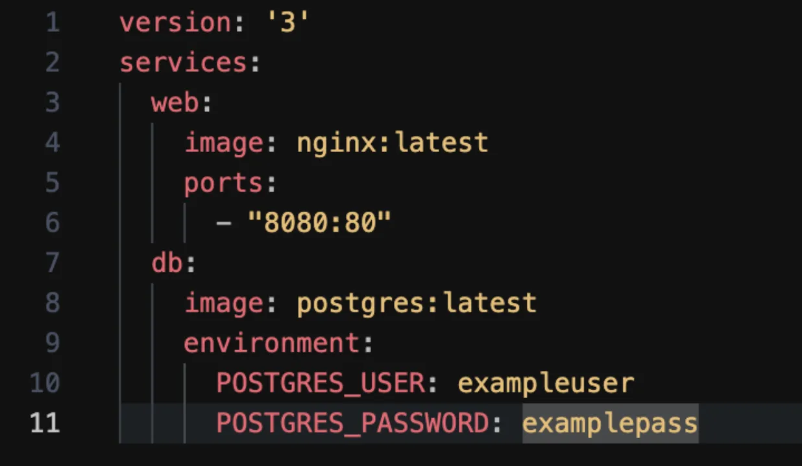

# Лоцман Сергей Михайлович
# Тестовое задание для Devops инженера
# Bogoda Digital Pro * Проект Guider (Справочник компаний с картами городов в Коста-Рике)

1. **Общие концепции DevOps:**
    - Опишите, что такое DevOps и какие проблемы оно решает в процессе разработки и эксплуатации ПО.

        DevOps — это методология разработки, которая помогает наладить эффективное взаимодействие разработчиков с другими IT-специалистами. Это набор процессов и инструментов, которые позволяют компании создавать и улучшать продукты быстрее, чем при использовании традиционных подходов к разработке программного обеспечения.

        Слово «DevOps» является объединением слов «разработка» (development) и «операции» (operations). DevOps помогает увеличить скорость доставки приложений и услуг. Это позволяет организациям эффективно обслуживать своих клиентов и становиться более конкурентоспособными на рынке. Проще говоря, DevOps — это согласованность между разработкой и ИТ-операциями с более эффективным взаимодействием и сотрудничеством.

        DevOps предполагает такую культуру, при которой сотрудничество между командами разработчиков, операторами и бизнес-командами считается критически важным аспектом. Речь идет не только об инструментах, поскольку DevOps в организации постоянно приносит пользу и клиентам. Инструменты являются одним из его столпов, наряду с людьми и процессами. DevOps увеличивает возможности организаций по предоставлению высококачественных решений в кратчайшие сроки. Также DevOps автоматизирует все процессы, от сборки до развертывания, приложения или продукта.

        DevOps дает команде:

            - Меньше ошибок. Одна из причин, почему случаются сбои при развертывании, связана с багами. В DevOps циклы разработки короче обычных, поэтому код выходит чаще. В результате искать ошибки становится проще, а значит, количество сбоев уменьшается.

            - Сокращение времени выхода сервиса на рынок. Масштабируемые инфраструктуры — облачные платформы, инструменты для ускорения сборки, параллельные рабочие процессы, работа в одной среде — сильно сокращают время работы. Развертывать и запускать приложение стало в разы быстрее.

            - Создание более гибких и отказоустойчивых систем. Это достигается за счет использования облачной инфраструктуры. Она дает возможность быстро масштабировать систему, использовать только нужное количество ресурсов и оперативно увеличивать мощности.

            - Повышенная надежность и безопасность приложений. Среди DevOps-инструментов есть те, которые анализируют исходный код программного обеспечения, чтобы определить, есть ли в нем недостатки безопасности. Еще есть приложение, которое сканирование сервисы на наличие в них уязвимостей — OWASP (Open Web Application Security Project).

2. **CI/CD (Continuous Integration and Continuous Deployment):**
    - Объясните, что такое CI/CD и почему оно важно в DevOps.

        CI/CD — это одна из DevOps практик, которая позволяет разработчикам чаще и надёжнее развёртывать изменения ПО, свести к минимуму ошибки, повысить темпы сборки и качество разрабатываемого продукта. Представляет собой комбинацию continuous integration и continuous delivery.

        CI, или непрерывная интеграция — процесс постоянной разработки ПО с интеграцией в основную ветвь. Автоматически собирает софт, тестирует его и оповещает, если что-то идёт не так.

        CD, или непрерывная доставка — процесс постоянной доставки ПО до потребителя. Обеспечивает разработку проекта небольшими частями и гарантирует, что он может быть отдан в релиз в любое время без дополнительных ручных проверок.

        Основное преимущество CI/CD в том, что разработчику нужно только написать код, а остальные процессы по тестированию, сборке и доставке проходят автоматически.

    - Перечислите основные этапы CI/CD пайплайна.

        - Разработчик пишет код, проводит начальное тестирование, чтобы не было ошибок, и фиксирует изменения в своей рабочей ветке. Затем соединяет модифицированный код с рабочим кодом из основной ветки.

        - Система, выбранная инструментом CI, замечает, что в коде произошли изменения и запускает автоматическую сборку и автоматическое тестирование программы.
        Если автоматическое тестирование прошло успешно, ПО отдаётся для ручного тестирования команде тестировщиков.

        - После исправления недочётов, обнаруженных во время ручного тестирования, запускается автоматизированная установка ПО на серверах компании.
        Осуществляется поддержка новой версии программы и её мониторинг.

        - Собираются запросы на исправление недочётов и багов, разработчик вносит изменения в код, и процесс повторяется.


3. **Мониторинг и логирование:**
    - Зачем необходимо мониторинг в DevOps и какие инструменты вы знаете для этого?

        Мониторинг DevOps подразумевает контроль всего процесса разработки: от планирования, разработки и интеграции до тестирования, развертывания и эксплуатации. При этом в режиме реального времени можно осуществлять всестороннее наблюдение за состоянием приложений, служб и инфраструктуры в рабочей среде. Среди критически важных компонентов мониторинга приложений и служб — такие возможности, как потоковая передача данных в реальном времени, воспроизведение истории и визуализация.
        
        Мониторинг DevOps позволяет командам быстро и автоматически реагировать на любое ухудшение качества обслуживания клиентов. Что еще более важно, команды могут выполнять «сдвиг влево» к более ранним этапам разработки и сводить к минимуму неудачные изменения в рабочей среде. В качестве примера можно привести усовершенствованные средства контроля для выявления ошибок в ПО и реагирования на них как вручную (система дежурств), так и по возможности автоматически.

        Эффективный инструмент мониторинга повышает производительность системы, а также помогает сократить (или даже устранить) время простоя. Можно правильно планировать обновления и новые проекты, а также лучше распределять свое время и ресурсы. Вы можете обнаружить проблемы и решить их прежде, чем они повлияют на пользователей

        Инструменты мониторинга:
            Prometheus + Grafana
            Nagios
            Sensu
            ELK = Elasticsearch + logstash + Kibana

    - Объясните различие между мониторингом и логированием.
        Различие между мониторингом и логированием заключается в их целях и задачах:

        Мониторинг — это процесс наблюдения и сбора данных о производительности, поведении и состоянии компьютерной системы либо приложения. Цель мониторинга — обеспечение оптимальной работы системы и приложений, а также определение и разрешение проблем по мере их возникновения.

        Логирование — это практика сбора и сохранения данных о событиях, возникающих в системе или приложении. Эти данные могут включать информационные сообщения, предупреждения, ошибки и прочую информацию, обычно сохраняемую в файле журнала или базе данных.

        Таким образом, мониторинг помогает управлять производительностью приложения, а логирование — управлять данными внутри логов. 

        

4. **Контейнеризация и Docker:**
    - Объясните, что такое контейнеры и чем они отличаются от виртуальных машин.

        Виртуальная машина (ВМ) — операционная система (ОС), которая развернута внутри другой операционной системы. ВМ имеет свое ядро и некоторые обособленные ресурсы. ВМ является абстракцией, позволяя превращать один реальный сервер в несколько виртуальных. Создание ВМ имеет смысл при необходимости управления всеми настройками ядра ОС. Это дает возможность избегать конфликтов ядра с аппаратным обеспечением, поддерживать больше функций, чем предусматривает определенная сборка, оптимизировать и устанавливать системы с модифицированным ядром.

        Контейнеры — это модули, в каждом из которых запускается одно приложение. Они занимают меньше памяти, используют небольшое количество ресурсов и почти не зависят от операционной системы кластера. Контейнеры работают по-другому: для установки и запуска платформы контейнеризации нужно уже установленное ядро операционной системы (в том числе виртуальной). ОС выделяет системные ресурсы под контейнеры, внутри которых содержится полностью настроенная среда для развертывания приложений.

        Контейнеры так же, как и виртуальные машины, без проблем переносятся между серверами, обеспечивая определенный уровень изоляции. При этом для успешного развертывания достаточно, чтобы совпадала база ядра (например, Linux, Windows или macOS), а конкретные версии ОС не имеют значения. Таким образом, контейнеры являются связующим звеном между уровнем системного ядра и уровнем приложений.

        На одинаковом оборудовании можно запустить большое количество контейнеров, тогда как ВМ будет в разы меньше. Это важно при использовании облачной инфраструктуры — потребуется меньше ресурсов.

    - Перечислите основные команды Docker для работы с контейнерами.

        docker start — запускает остановленный контейнер;

        docker stop — останавливает работающий контейнер;

        docker restart — перезапускает контейнер;

        docker pause — пауза (приостановка всех процессов контейнера);

        docker unpause — снятие паузы;

        docker attach — подключение к существующему контейнеру;

        docker rm — удаляет один или несколько контейнеров, которые уже остановлены;

        docker ps — отображает список активных контейнеров в системе;

        docker logs — логи контейнера;

        docker port — публичные порты;

        docker top — выполняющиеся процессы;

        docker stats — использование ресурсов;

        docker diff — изменения в файлах или директориях файловой системы контейнера;

        docker pull — загружает образы из удалённого репозитория Docker Hub;

        docker build — собирает образ Docker из Dockerfile и «контекста» (набора файлов по определённому пути или URL);

        docker images — список образов;

        docker rmi — удаление образа;

        docker run — запускает контейнер на основе указанного образа.
        

5. **Сетевые основы:**
    - Объясните, что такое NAT и как оно работает.

        NAT (Network Address Translation) — это технология, используемая в сетевых устройствах для преобразования частных (локальных) IP-адресов в публичные (глобальные) IP-адреса и обратно. Эта технология позволяет нескольким устройствам в локальной сети использовать один и тот же публичный IP-адрес для доступа к интернету, что особенно полезно в условиях ограниченного количества доступных публичных IP-адресов. 
        
        Основные функции и особенности NAT
        
        - Преобразование адресов: NAT преобразует частные IP-адреса устройств в локальной сети в один или несколько публичных IP-адресов при их отправке в интернет, и обратно – публичные IP-адреса пакетов, приходящих из интернета, в частные IP-адреса.

        - Экономия IP-адресов: NAT позволяет сократить потребность в публичных IP-адресах, так как несколько устройств в локальной сети могут использовать один и тот же публичный IP-адрес.

        - Повышение безопасности: NAT скрывает внутреннюю структуру сети от внешних пользователей, что затрудняет несанкционированный доступ извне.

    - Что такое DNS и как оно используется в сетях?

        DNS (Domain Name System) — система доменных имён, выполняющая роль каталога имён сайтов в интернете.

        Любой сайт, доступный в глобальной сети, располагается на определенном физическом устройстве. Чтобы идентифицировать такое устройство в сети, ему назначается IP-адрес — идентификатор вида XXX.XXX.XXX.XXX.

        Для открытия определенного сайта необходимо узнать IP-адрес девайса, на котором тот расположен.

        Пользователи каждый день работают с множеством сайтов, и очень сложно запомнить IP-адреса стольких устройств. Поэтому, чтобы проще было работать, используется система доменных имен.

        Основной алгоритм

        Любому IP-адресу назначается домен — простое и понятное имя. После ввода доменного имени в браузер:

            1. Этот запрос переадресуется на DNS-сервер.
            2. DNS-сервер анализирует доменное имя и трансформирует его в IP-адрес.
            3. По IP-адресу устройство ищется во всемирной паутине.
            4. Если оно найдено, запрос обрабатывается и возвращается ответ. В итоге пользователь видит запрошенный сайт.
            5. Если не удалось определить IP-адрес устройства, пользователь получает сообщение об ошибке.

6. **Git и управление версиями:**
    - Объясните, что такое ветвление (branching) в Git и зачем оно нужно.

        Ветвление (branching) в Git, позволяющее работать над разными версиями проекта. Таким образом, вместо одного перечня с упорядоченными коммитами история может расходиться в некоторых точках, поэтому становится похожей на дерево. И каждая ветвь содержит в Git легковесный указатель HEAD, указывающий на последний коммит в данной ветке. В результате можно легко создать много веток. Делая это, называйте ветки согласно разрабатываемой функциональности. Ветку по умолчанию называют master


    - Как создать новую ветку и переключиться на нее в Git?

        git branch <имя_ветки> — создание новой ветки <имя_ветки>

        git checkout <имя_ветки> — переключение на ветку <имя_ветки>

7. **Безопасность:**
    - Какие основные методы обеспечения безопасности вы знаете для серверов и сервисов?

        Обеспечение защиты сервера от взлома всегда включает комплекс различных мер. Условно методы можно разделить на следующие направления:

            - Защита каналов связи, через которые осуществляется администрирование и использование системы.

            - Организация нескольких уровней безопасности системы.

            - Разграничение доступа к ресурсам инфраструктуры.

            - Мониторинг и аудит систем.

            - Резервное копирование.

            - Своевременные обновления (или откаты) ПО.

        При организации доступа к ресурсам следуйте универсальному правилу — процессы и пользователи должны иметь доступ только к тем ресурсам, которые минимально необходимы для работы. Особенно это касается баз данных и операционных систем. Принцип наименьших привилегий поможет наладить защиту сервера от несанкционированного доступа извне, минимизировав ущерб, а также от внутренних угроз.

        Для каждого администратора лучше всего создать отдельную учетную запись, а операции, не требующих повышенных прав, нужно выполнять с непривилегированных аккаунтов.

        При работе с *nix системами не следует постоянно работать под учетной записью root. Лучше всего ее отключить и использовать программу sudo.

        При удаленном администрировании операционной системы Linux используйте безопасный протокол SSH.

        Правильная система безопасности состоит из уровней. Не стоит надеяться только на механизмы разграничения доступа. Логичней контролировать сетевые соединения до того, как они доберутся до сервисов. Для этого существуют файрволы.

        Межсетевой экран (брандмауэр или файрвол) обеспечивает контроль доступа на уровне сети к участкам инфраструктуры. Руководствуясь определенным набором разрешающих правил, файрвол определяет, какой трафик пропускать через периметр. Все, что под правила не попадает, блокируется. Следует заметить, что в Linux, брандмауэр является частью ядра (netfilter), поэтому для работы в пользовательском пространстве необходимо установить фронтенд: nftables, iptables, ufw или firewalld.

        Первое, что нужно сделать при настройке фаервола — закрыть неиспользуемые порты и оставить только те, к которым предполагается доступ извне. Например, для веб-сервера это порт 80 (http) и 443 (https). Ничего кардинально опасного в открытом порту нет (угроза может быть в программе, стоящем за портом), но все же лучше убрать лишнее.

    - Что такое SSH и как его используют для безопасного доступа к серверам?

        SSH — это сетевой протокол для удалённого управления операционной системой с помощью командной строки и передачи данных в зашифрованном виде.

        SSH позволяет:

            - безопасно передавать в незащищённой среде практически любой другой сетевой протокол;

            - удалённо работать на компьютере через командную оболочку;

            - передавать по шифрованному каналу звуковой поток или видео (например, с веб-камеры).

        Для работы по SSH необходимы два компонента: SSH-сервер и SSH-клиент. Сервер прослушивает определённый порт (по умолчанию это порт 22) и при успешной аутентификации даёт доступ пользователю. 

        Проверка личности пользователя в SSH происходит по паролю. Установив аутентификацию по SSH-ключам, вы повысите защиту сервера, так как длинный ключ значительно сложнее подобрать, к тому же не придется вводить пароль (ключ хранится на сервере). Если не хотите использовать ключи, присмотритесь к программе Fail2ban, которая ограничивает число попыток ввода пароля и блокирует IP-адреса. Также же не лишним будет поменять порты по умолчанию: 22/tcp для SSH

8. **Оркестрация:**
    - Что такое оркестрация контейнеров и зачем она нужна?

        Оркестрация контейнеров — это координация взаимодействия нескольких контейнеров. Она позволяет создавать информационные системы из множества контейнеров, каждый из которых отвечает только за одну определённую задачу, а общение осуществляется через сетевые порты и общие каталоги. При необходимости каждый такой контейнер можно заменить другим, что позволяет, например, быстро перейти на другую версию базы данных.

    - Какие оркестраторы контейнеров вы знаете и используете?

        Наиболее известны следующие системы:

            — Kubernetes,

            — Docker Swarm,

            — Apache Mesos.

        Есть не большой опыт использования Kubernetes и Docker Swarm.


9. **Docker-compose**
    - Объясните, что делает docker-compose.yml файл выше.
```
version: '3'
services:
    web:
        image: nginx:latest
        port:
        - "8080:80"
    db:
        image: postgres:latest
        environment:
            POSTGRES_USER: exampleuser
            POSTGRES_PASSWORD: exampleuser
```

        Этот пример настраивает веб-сервер Nginx и базу данных PostgreSQL. Для веб-службы используется образ nginx, а порт 8080 открывается внутри контейнера с хост-машины. Для службы базы данных используется образ postgres, а переменная среды `POSTGRES_USER` и `POSTGRES_PASSWORD` устанавливается в значение exampleuser.

    - Опишите шаги, как запустить этот проект с помощью Docker Compose.

        Файл docker-compose.yml должен находиться в корневой директории проекта. В нём нужно определить сервисы, сети и тома, которые будут использоваться приложением. Выполнить команду `docker-compose up --build` в директории с файлом `docker-compose.yml`. Эта команда создаст и запустит все сервисы, определённые в файле конфигурации. Флаг `--build` указывает Docker Compose на то, что нужно сначала пересобрать образы контейнеров перед их запуском. 


    - Как можно изменить файл, чтобы добавить том для хранения данных PostgreSQL?
        

        Нужно дописать строчку, в которой volume app-db-data монтируется в директорию /var/lib/postgresql/data/pgdata внутри контейнера службы db. И для среды db определить дополнительные переменные окружения: PGDATA, POSTGRES_DB. Приблизительный текст файла `docker-compose.yml` находиться ниже.

```
version: '3'
services:
    web:
        image: nginx:latest
        port:
            - "8080:80"
    db:
        image: postgres:latest
        volumes:
            - app-db-data:/var/lib/postgresql/data/pgdata
        environment:
            PGDATA=/var/lib/postgresql/data/pgdata
            POSTGRES_DB=DB_PG
            POSTGRES_USER: exampleuser
            POSTGRES_PASSWORD: exampleuser
```

10.  Практическое задание
    - Создайте Dockerfile для Django Python приложения (только Dockerfile, приложение нам не нужно) где:
        
        ```
        1. Зависимости устанавливаются через pip3 install -r requirements.txt
        2. Запуск происходит через команду python3 manage.py runserver 0.0.0.0:8000
        3. и requirements.txt и manage.py находятся в корневой директории проекта
        ```

        В директории проекта создам папку frontend, в которой будет находиться файл под названием `Dockerfile` c содержимым:

        ```
        FROM python:3.11
        ENV PYTHONUNBUFFERED 1
        RUN mkdir /web_django
        WORKDIR /web_django
        COPY requirements.txt /web_django/
        RUN pip install --upgrade pip && pip install -r requirements.txt
        ADD . /web_django/ 
        ```
        
        Данная настройка создает в образе python директорию с нашим проектом, копирует туда список пакетов, которые нужно установить и устанавливает их. Также папка с кодом из образа привязывается к директории web_django в корне проекта. Перед установкой пакетов обновляется менеджер пакетов pip во избежании проблем с версией(--upgrade pip).

    - Создайте docker-compose.yml файл с Django приложением (образ которого должен собираться из Dockerfile который вы сделали), условным frontend и postgres где:
        
```
1. frontend на порте 3000, билдится из абстрактной директории frontend, запускается командой "run 0.0.0.0"
2. Используется postgres 16 на базе alpine linux 
3. Контейнеры между собой общаются, балансер не нужен
```

В корне проекта создаем файл `docker-compose.yml` со следующим содержимым:

```
version: '3'
services:
web:
    build: ./frontend
    command: python manage.py runserver 0.0.0.0:3000
    volumes:
        - ./web_django
    ports:
        - '3000:3000'
    depends_on:
        - db
db:
    image: postgres:16-alpine
    ports:
        - '5433:5433'
    environment:
    POSTGRES_DB: 'db_django'
    POSTGRES_USER: 'postgres'
    POSTGRES_PASSWORD: 'password'
    restart: always
    volumes:
        - ./db_django:/var/lib/postgresql/data/pgdata
```


        **Дополнительно (не обязательно, но будет огромным плюсом если сделаете):**
        
        С помощью системы heathcheck в docker-compose сделайте так, чтобы контейнер frontend запускался только когда django работает стабильно, а django запускался только когда postgres работает стабильно.
        endpoint для проверки Django: http://localhost:8000/health/ (он ничего не возвращает)
        
